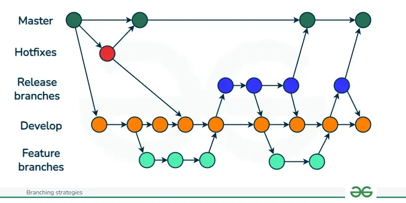
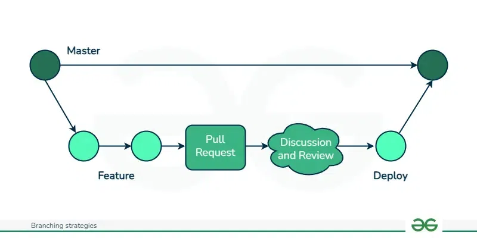
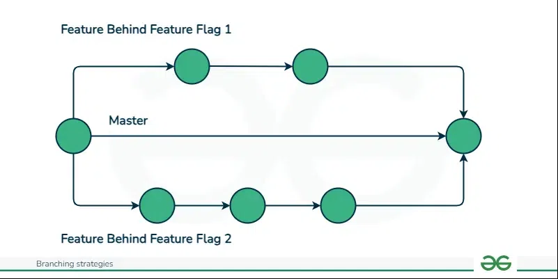

1. What is the difference between --soft, --mixed and --hard in git rest?

- soft: Resets to the mentioned commit and uncommits the other commit but keeps the changes as staged
- mixed: Resets to mentioned commit and keeps the changes as unstaged
- hard: Resets to mentioned commit and removes all changes done after mentioned one

2. Which one is destructive and why?

A. git reset --hard is destructive because it completely removes changes done in other commits.

3. When would you use each one?

A. soft will be used to undo a commit, mixed will be used to undo a commit along with unstage the changes while hard will be used to completely discard the changes.

4. Should you ever use git reset on commits that are already pushed?

A. No, as it changes the history which is why it is not recommended.

5. How is git revert different from git reset?

A. git revert undoes change by creating a new commit which is recorded in the history whereas git reset undoes changes without recording anything in history.

6. Why is revert considered safer than reset for shared branches?

A. As it creates a new commit to undo changes and stays in git history

7. When would you use revert vs reset?

A. Revert should be used in shared repositories so that everything stays in history whereas reset should be used in local or private repos to keep your history clean as it rewrites the history.

| | `git reset` | `git revert` |
|---|---|---|
| What it does | Undo commit | Undo commit |
| Removes commit from history? | Yes | No |
| Safe for shared/pushed branches? | No | Yes |
| When to use | Shared/Public repo | Local/Unpushed changes |

## Branching Strategies

# GitFlow

Enables parallel development allowing developers to work separately on feature branches and development branch. A feature/development is created from master and required changes are done post which it is merged with master.

Where it is used?
- Scheduled and periodic version release
- Products with long maintenance cycles

Pros:
- Enables parallel development
- Organizes work effectively
- Clear process to handle bugs and release hotfixes quickly into production

Cons:
- Complexity increases as more branches are added
- Debugging becomes difficult with long commit history
- Complex branching can slow development and delay releases which is less ideal for CI/CD

# GitHub Flow

It is a lightweight branching strategy that keeps the branch always deployable and supports fast, continuous development.

Where it used?
- Small projects with fast-paced development cycles
- Continuous deployment and release

Pros:
- Focuses on fast branching, quick releases and short production cycles
- Teams can quickly identify bugs and resolve issues as it is based on feedback loop
- Ideal for small teams and web application with single production version

Cons:
- Merge conflict may occur as everyone merges to single branch
- Not ideal for maintaining multiple versions of codebase
- Risk of unstable production if changes aren't tested before merge

# Trunk Based Development(TBD)

It is a branching strategy where all developers work on a single main branch keeping it always in a release ready state.

Where it is used?
- Teams which do frequent releases
- Process with strong automated testing and CI/CD pipelines

Pros:
- Fast and rapid integration of branches
- Reduce complexity and merge conflicts
- Promotes frequent communication and code review

Cons:
- Strict code review is required
- Main branch can be unstable if no proper testing is done

8. Which strategy would you use for a stratup shipping fast?

A. Trunk based development

9. Which strategy would you use for a large team with scheduled releases?

A. GitFlow

10. Which one does your favorite open-source project use? 

A. Kubernetes uses GitHub Flow strategy, clone, create short lived working branches for features and fixes and submitting pull requests to the upstream repository.