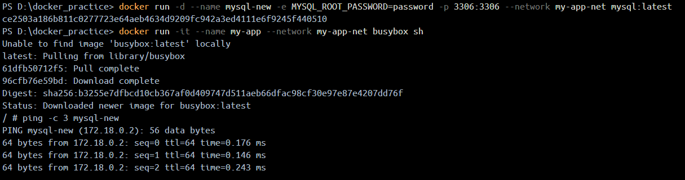

1. What is the difference between bind mount and named volumes?

A. Bind mount links a specific file or directory of your host machine to container whereas volumes are completely managed by docker, ideally stored in a specialized directory.

2. Why does custom networking allow name based communication but the default bridge doesn't?

A. Custom networking has embedded DNS which allows automatic service discovery and update its records accordingly. Whereas in default bridge only IP based communication is possible.

## Task:6

Run my-sql container and app in a custom user made bridge network and verify if they are reachable:

