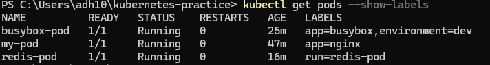

## Four required fields of Kubernetes manifest

1. apiVersion: Specifies which version of Kubernetes api to use
2. kind: Tells which type of object to create like pod, service, deployment
3. metadata: Data that uniquely identifies the object like name, id and labels
4. spec: Core specification that defines the desired state and charateristic of the object

## Difference between declarative(kubectl apply -f) and imperative(kubectl run)

Declarative is a yaml file which is completely defined by user whereas in imperative a yaml file is generated automatically with many additional details when we run kubectl run redis-pod --image=redis:latest

## What happens when you delete a standalone pod?

It can be recovered, it is deleted permanently.

## Running pods

