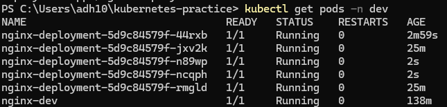

1. What namespaces are and why you would use them?

Namespaces are created to isolate clusters so that different teams can work on different clusters without interference.

2. Explanation of each section of deployment manifest:

apiVersion: Uses stable api group which is required for Deployments
kind: Tells what kind of object will be created
metadata:
  name: This is the Deployment's name
  namespace: scoped to a single namespace
  labels: used for querying and organizing resources
  spec: Tells the desired state
    replicas: Kubernetes will maintain 3 running pods all the time, restarting any after crash
    selector.matchLabels: Tells the deployment which pods it owns by matching the label
    template: the blueprint for each pod it creates
    spec.containers: Defines the single container running inside each pod
      name: container name
      image: image that needs to be pulled to be used
      containerPort: documents that the container listens on port 80

3. What happens when you delete a pod managed by Deployment vs a standalone pod?

When a pod is deleted which is managed by Deployment it automatically creates another pod with same specifications whereas in standalone pod it never recreats.

4. How scaling works(both imperative and declarative)?

Scaling adjusts the number of pod replicas.
Imperative scaling can be used to directly scale number of replicas using CLI. The kubectl scale command is used to directly update spec.replicas field of a specific resource. The Kubernetes control plane then works to match the number mentioned to bring it to desired state.
Desclarative scaling is modifying the YAML file, and run kubectl apply command Kubernetes compares the state and does necessary changes

5. How rolling updates and rollbacks work?

Rolling updates gradually updates pod one by one having zero downtime. It won't delete the old version until and unless new version is up and running.

If new version is faulty, with rollback command the update reverts to previous version deleting the new ones. Kubernetes saves the previous deployment configuration.

6. Image of Deployment pods running:

## How many pods are running in kube-system?

10 pods are running which includes:
- 2 core dns
- 3 kindnet 
- 3 kube-proxy
- etcd
- API server
- control-plane
- scheduler

## Does `kubectl get pods` show these pods? What about `kubectl get pods -A`?

No, `kubectl get pods` doesn't show any pods. It shows there are no pods in default namespace.
`kubectl get pods -A` shows list of pods from all namespaces.

## What do the READY, UP-TO-DATE and AVAILABLE columns mean in deployment output?

READY: Shows the number of pods running and have passed the readiness probes
UP-TO-DATE: Indicates how many replicas have been updated to match the latest desired configuration
AVAILABLE: Shows how many replicas are available to users to server traffic

## Is the replacement pod's name the same as the one you deleted, or different?

It is different, the name is same but the last 5 ids name is different.

## When you scale down from 5 to 2, what happens to extra pods?

Extra pods goes through graceful termination.

## What image is running after rollback?

The old version of nginx, 1.24 is running after roll back

