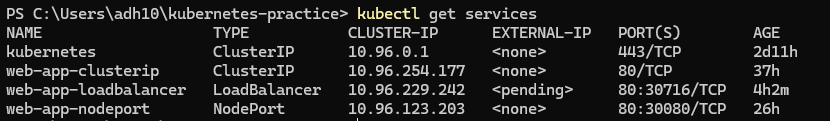

## What problem Services solve and how they relate to Pods and Deployments?

Pods get random IPs and change when they restart. To have a stable network, have constant IPs, Services come into picture.

## Three different types of service manifests:

- clusterIP manifest: Defines a stable, internal IP address and DNS name for pods, enabling communication within the cluster
- nodePort manifest: Exposes the application externally by opening up a static port on each node's IP address
- loadBalancer manifest: Exposes the application to external traffic by requesting a load balancer from underlying cloud provider

## Difference between clusterIP, nodePort and loadBalancer

ClusterIP exposes services internally, Nodeport exposes services externally on specific port of every node while loadbalancer exposes services publicly using cloud provider's load balancer.

## How Kubernetes DNS works for service discovery?

In Kubernetes, DNS is used for service discovery, meaning pods can communicate with stable names instead of IP addresses. Kubernetes runs a DNS service called core DNS running inside cluster to handle DNS queries.

When service is created, it gets a DNS name. When pod tries to access name, a query goes to core DNS, core DNS resolves it to Service's clusterIP and kube-proxy routes traffic to backend pods.

## What Endpoints are and how to inspect them?

Endpoints are API objects that act as dynamic address book for a Service. They map a Service to specific IP address and ports of the backend Pods that are ready to receive traffic.

To see all endpoints:
kubectl get endpoints

Inspect a specific endpoint:
kubectl get endpoints my-service

## Screenshot

