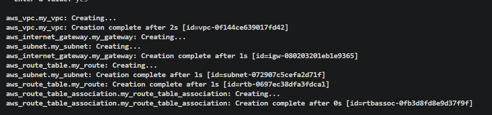
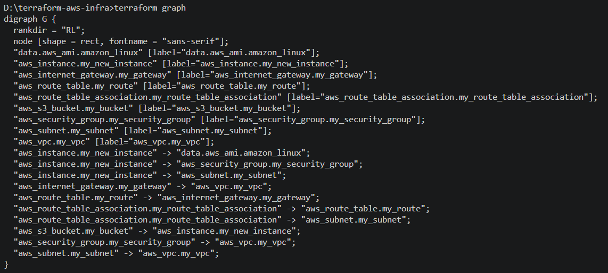

### What does `~> 5.0` mean? How is it different from `>= 5.0` and `= 5.0.0`?

This means, minimum version should be 5.0.0 and maximum version should be less than 6.0.0. Minor version upgrade is fine but no major version upgrade.

### How does Terraform know to create the VPC before the subnet?

Terraform automatically determines the correct creation order by analyzing implicit dependencies defined in your configuration and creating a dependency graph.

### What would happen if you tried to create the subnet before the VPC existed?

It will automatically create it by changing the sequence. It will create a dependency graph when terraform plan is run and identify the implicit dependencies accordingly creates the infrastructure.

### Find all implicit dependencies in your config and list them

- aws_subnet
- aws_internet_gateway
- aws_route_table
- aws_route_table_association

### When would you use `depends_on` in real projects?

- When a resource depends on creation of IAM policy first. Resource creation might fail if you are using the IAM user to create the resource
- When there is no attribute reference dependencies between modules then we bring in depends_on

### What are three lifecycle arguments and when would you use each?

- create_before_destroy: By default, terraform destroys the old one and then creates the new resoruce. By setting this to true we allow it to create the resoruce before destroying.
- prevent_destroy: This argument acts as a safety mechanism, causing terraform to reject any plan that would destroy the associated infrastructure
- ignore_changes: A list of resource which terraform should ignore when planning for updates

### Terraform apply

### Terraform graph

### Implicit dependencies

When one resource is dependent on another resource while creating an infrastructure. We can refer it in same file where the other resource is defined.

### Explicit dependencies

We use if there is no way to create a dependency between resources as we did in implicit dependencies. We can create explicit dependency using depends_on where we can refer to the resource we want it to depend on. So, this resource won't be implemented unless and until the first one is not implemented.