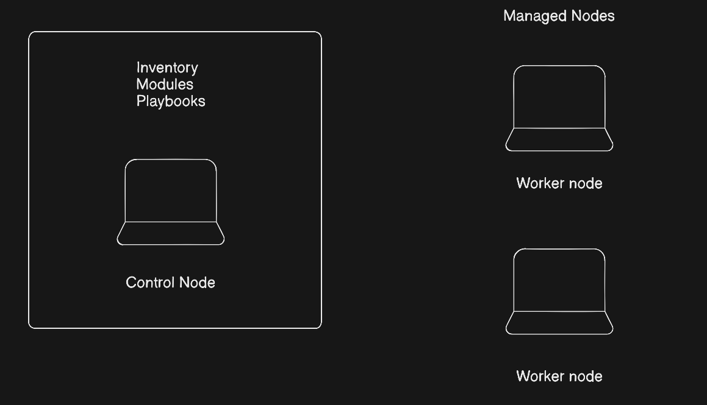
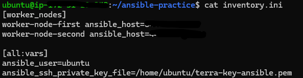
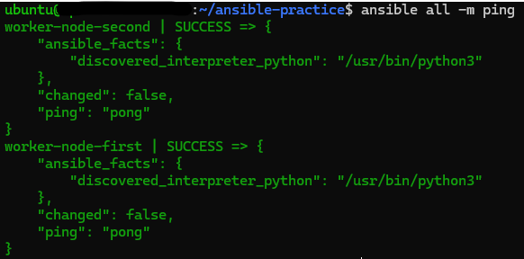

### Task 1

1. What is configuration management? Why do we need it?

It is a process of maintaining system's functional, physical and performance attributes throughout its lifecycle. Reasons why we need it:

- Consistency: It is required to have consistent and identical servers 
- Security and compliance: It helps in rapid deployment of security packages
- Reduce manual work: No need of configuring servers manually, one by one, one person can manage multiple servers at once.

2. How is ansible different from chef, pupppet and salt?

- Chef, pupppet and salt all of them are agent based tools whereas ansible is agentless.
- Chef uses Ruby, puppet uses DSL and salt uses yaml + python whereas ansible only uses yaml syntax
- Ansible is the most easy for setup and use whereas others we need to know a programming language to work with.

3. What does agentless mean? How does Ansible connect to managed nodes?

Agentless means that there is no software, daemon or background processes that needs to be installed or maintained in the managed nodes. Ansible conncets to managed nodes using existing protocol called SSH.

4. Ansible architecture:

### Task 3

5. On which machine did you install Ansible? Why is it only needed on the control node?

On control-node I installed Ansible. As Ansible works on agentless concept, we need install it in the primary one.

### Task 4

Ping ad-hoc command was not working, it was continuosly throwing error public key denied.

What actions I took to solve the issue?

- Copy the private key in all the machines(control-node and both worker-nodes)
- Change the permissions to only read i.e. 400
- Change the owner to username(ubuntu)
- Mention the correct path of private key file in inventory file
- Then run, it would be successful

6. What does become do?

It runs the command in superuser mode which is sudo in linux

### Documentation

- Setup using Terraform with 3 instances: control-node, worker-node-first, worker-node-second

- `inventory.ini` file

- Ping output:

- Ad-hoc commands I ran:

1. ansible all -i inventory.ini -m ping
2. ansible all -i inventory.ini -m "command" -a "uptime"
3. ansible all -i inventory.ini -m "command" -a "df -h"
4. ansible all -i inventory.ini -m "command" -a "free -h"
5. ansible worker-node-first -i inventory.ini -m apt -a "name=git state=present" --become

- Difference between `command` and `shell` modules:

1. command doesn't use any shell like /bin/sh whereas shell module does
2. Pipes and redirections can be used in shell modules but not in command
3. command modules are more secured as shell injection is not possible
4. command modules are faster than shell modules
